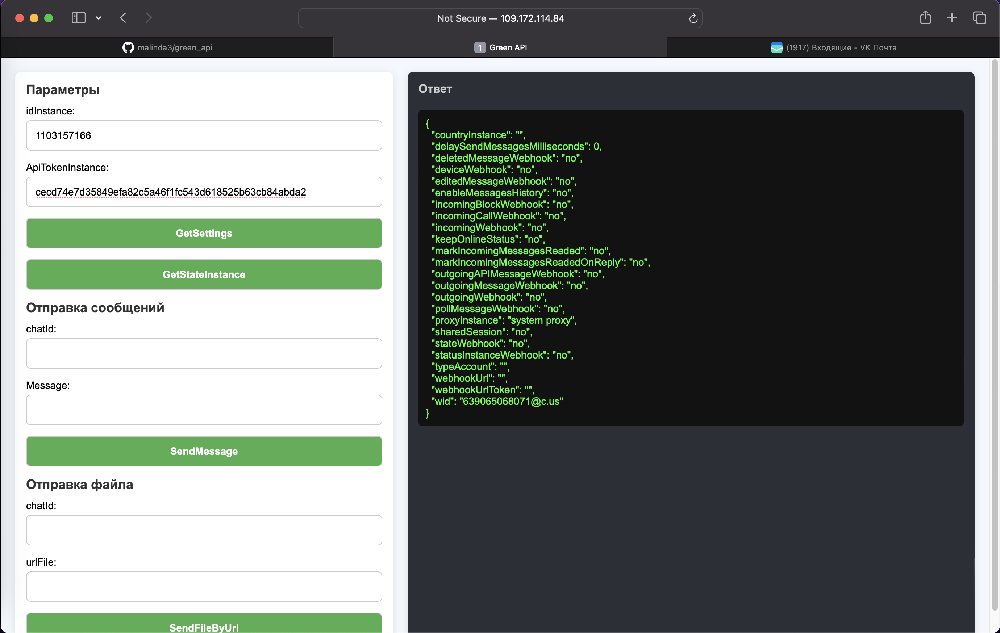

Что готово сейчас:

Приложение запускается и работает локально на docker-compose, запуск и развертывание достаточно быстро организованы при помощи докеризации, а так же docker-compose

Бекенд написан при помощи библиотеки backend/greenapi, которая реализовывает асинхронные низкоуровневые опрации к базе данных, методы библиотеки вызываются в backend/main.go, запускаются на порту 8881 

Ручки:

/send-message

/send-file

/getSettings

/getStateInstance

Фронтенд хостится на nginx, пока все запихал в один файл

все вместе запускается командой "docker-compose up"

приложение будет доступно по адресу http://localhost с хост системы, но нужнно подобрать порты в конфиге нгинкс, а так же в файле фронта index.html под требования, тк у меня все работает через viruialbox, захожу на 9000 порт через проброс портов 

